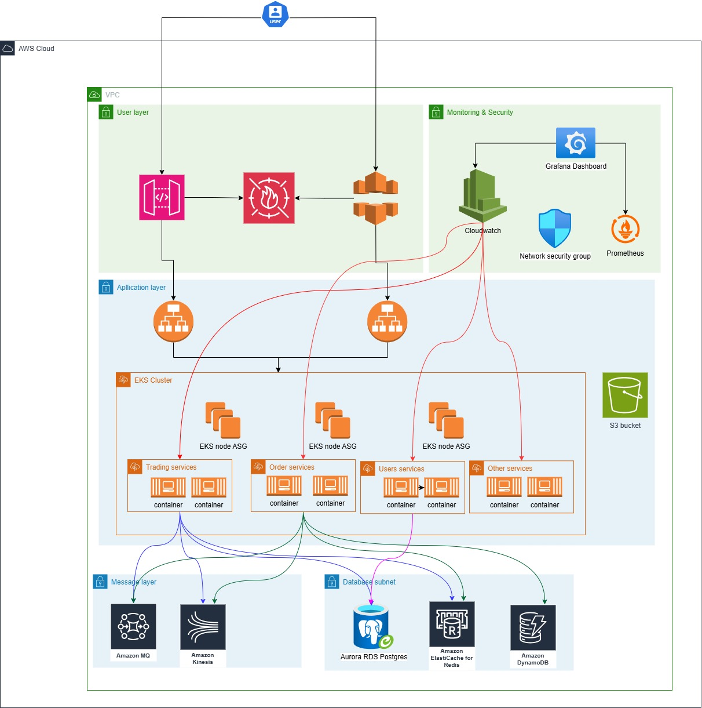

# AWS Cloud-Based Trading System Architecture

## Overview
This document outlines the architecture for a highly available trading system built on AWS. The system is designed to handle 500 requests per second with a p99 response time of <100ms, providing secure and reliable trading operations for users globally.

## Table of Contents
- [System Architecture](#system-architecture)
- [Key Components](#key-components)
- [Technical Specifications](#technical-specifications)
- [Scaling Strategy](#scaling-strategy)
- [Security Measures](#security-measures)
- [Monitoring and Maintenance](#monitoring-and-maintenance)
- [Disaster Recovery](#disaster-recovery)
- [Cost Optimization](#cost-optimization)
- [Compliance and Regulations](#compliance-and-regulations)
- [Development Workflow](#development-workflow)

## System Architecture

### Architecture Principles
- Microservices-based design for independent scaling and deployment
- Event-driven architecture for real-time processing
- Multi-AZ deployment for high availability
- Data consistency and durability prioritization
- Defense in depth security approach

## Key Components

### Client Layer
- **CloudFront**
  - Purpose: Global content delivery and DDoS protection
  - Benefits: 
    - Reduced latency through edge locations
    - Improved availability with global distribution
    - Built-in DDoS protection
    - SSL/TLS termination
  - Alternative: Cloudflare (third-party CDN)
  - Configuration:
    - Custom domain configuration
    - HTTPS enforcement
    - Geographic restrictions
    - Cache behavior optimization

- **Application Load Balancer**
  - Purpose: Traffic distribution across AZs
  - Benefits: 
    - Automatic scaling with demand
    - Health checks for reliability
    - SSL termination
    - WebSocket support
  - Alternative: Network Load Balancer
  - Configuration:
    - Target group settings
    - Health check parameters
    - SSL/TLS certificates
    - Access logging

### Application Layer
- **Trading Service**
  - Purpose: Order placement and validation
  - Implementation: 
    - ECS with Fargate
    - Docker containers for consistency
    - Circuit breaker patterns
    - Retry mechanisms
  - Technology Stack:
    - Node.js/TypeScript for performance
    - gRPC for inter-service communication
    - Redis for session management
    - Prometheus for metrics

- **Order Service**
  - Purpose: Order matching and execution
  - Implementation:
    - Dedicated EC2 instances
    - Custom matching engine
    - In-memory processing
  - Performance Features:
    - Sub-millisecond matching
    - Order book snapshots
    - Real-time market data
    - Price-time priority matching

- **User Service**
  - Purpose: User management and authentication
  - Implementation:
    - AWS Lambda for serverless operations
    - API Gateway integration
    - JWT token management
  - Features:
    - Multi-factor authentication
    - Session management
    - Rate limiting
    - Access control lists

### Data Layer
- **Aurora PostgreSQL**
  - Purpose: Primary database for user data
  - Configuration:
    - Multi-AZ deployment
    - Auto-scaling storage
    - Performance Insights enabled
    - Backup retention: 35 days
  - Scaling Features:
    - Read replicas across AZs
    - Connection pooling
    - Query performance tuning
    - Automated backups

- **ElastiCache Redis**
  - Purpose: Order book and market data caching
  - Configuration:
    - Cluster mode with sharding
    - Multi-AZ enabled
    - Encryption at rest
    - Backup enabled
  - Performance Settings:
    - Memory allocation
    - Eviction policies
    - Connection limits
    - Persistence configuration

- **DynamoDB**
  - Purpose: Order history and audit logs
  - Configuration:
    - On-demand capacity
    - Global tables for DR
    - Point-in-time recovery
    - TTL enabled
  - Features:
    - Auto-scaling
    - Stream processing
    - Backup and restore
    - Data encryption

### Message Layer
- **Amazon MQ**
  - Purpose: Order processing queue
  - Configuration:
    - Active-standby deployment
    - Multi-AZ enabled
    - Message persistence
    - Dead letter queues
  - Features:
    - MQTT/AMQP support
    - Message filtering
    - Queue monitoring
    - Auto-scaling

- **Kinesis**
  - Purpose: Market data streaming
  - Configuration:
    - Enhanced fan-out
    - Multiple shards
    - Server-side encryption
    - Retention: 24 hours
  - Features:
    - Real-time processing
    - Replay capabilities
    - Monitoring and alerts
    - Data persistence

## Technical Specifications

### Performance Requirements
- Throughput: 
  - Base: 500 requests per second
  - Burst: Up to 1000 requests per second
  - Scaling trigger: 70% utilization
- Latency:
  - 99%: <100ms
- Availability:
  - Target: 99.99% uptime
  - Planned maintenance: <4 hours/month
  - Recovery time objective (RTO): <15 minutes
  - Recovery point objective (RPO): <1 minute

### Infrastructure Configuration
- AWS Regions:
  - Primary: us-east-1
  - DR: us-west-2
- Compute Resources:
  - EKS Node Groups: t3.xlarge
  - Dedicated instances: c5.2xlarge
  - Lambda: 1024MB memory
- Networking:
  - VPC CIDR: 10.0.0.0/16
  - Private subnets: 10.0.1.0/24, 10.0.2.0/24
  - Public subnets: 10.0.3.0/24, 10.0.4.0/24

## Development Workflow
- **CI/CD Pipeline**
  - Source Control: GitHub
  - CI Tool: GitHub Actions
  - Deployment: AWS CodeDeploy
  - Infrastructure as Code: Terraform
  
- **Testing Strategy**
  - Unit Testing: Jest
  - Integration Testing: Postman/Newman
  - Load Testing: k6
  - Security Testing: OWASP ZAP

- **Release Process**
  - Feature branches
  - Pull request reviews
  - Automated testing
  - Blue-green deployment
  - Automated rollback

## Cost Optimization
- **Resource Optimization**
  - Reserved Instances for predictable loads
  - Spot Instances for batch processing
  - Auto-scaling policies
  - Right-sizing instances

- **Monitoring and Analysis**
  - Cost Explorer tracking
  - Budget alerts
  - Resource tagging
  - Usage analysis
